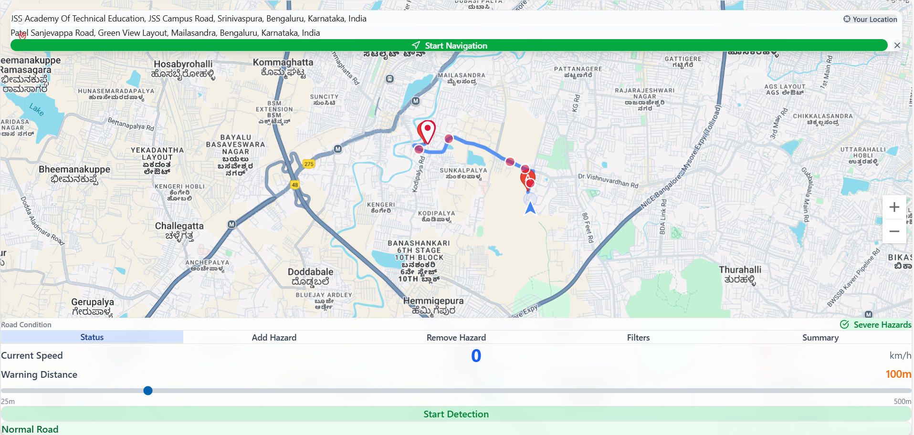
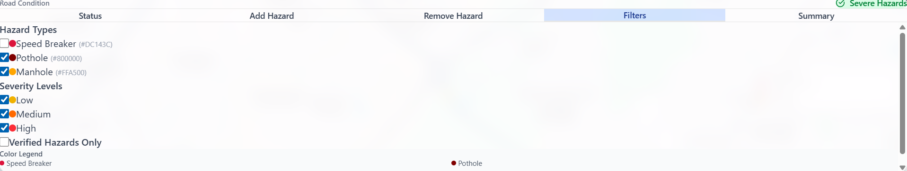
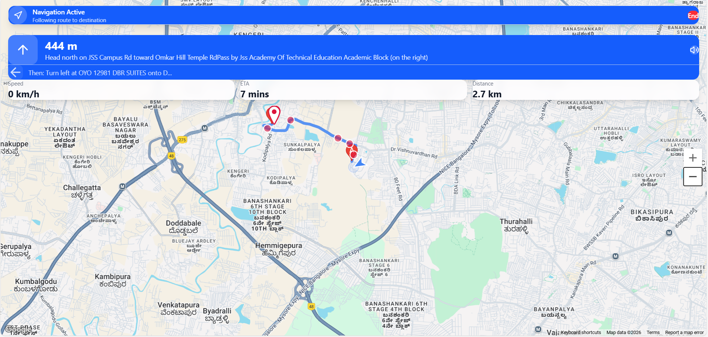
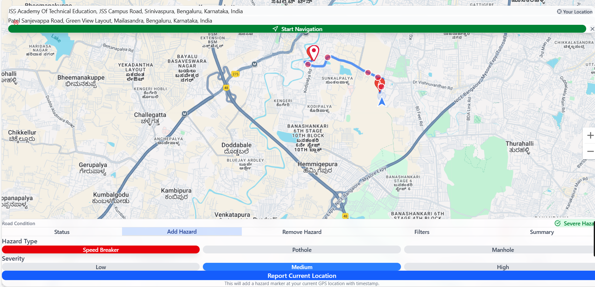
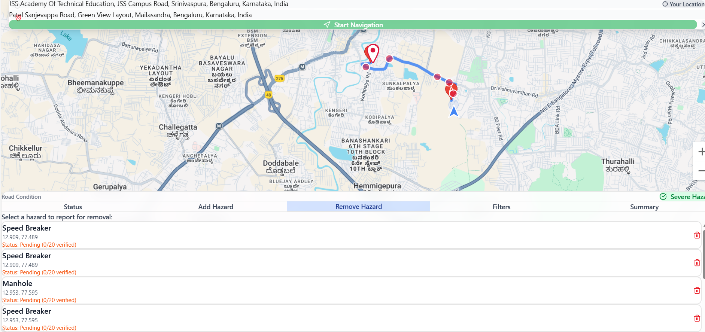
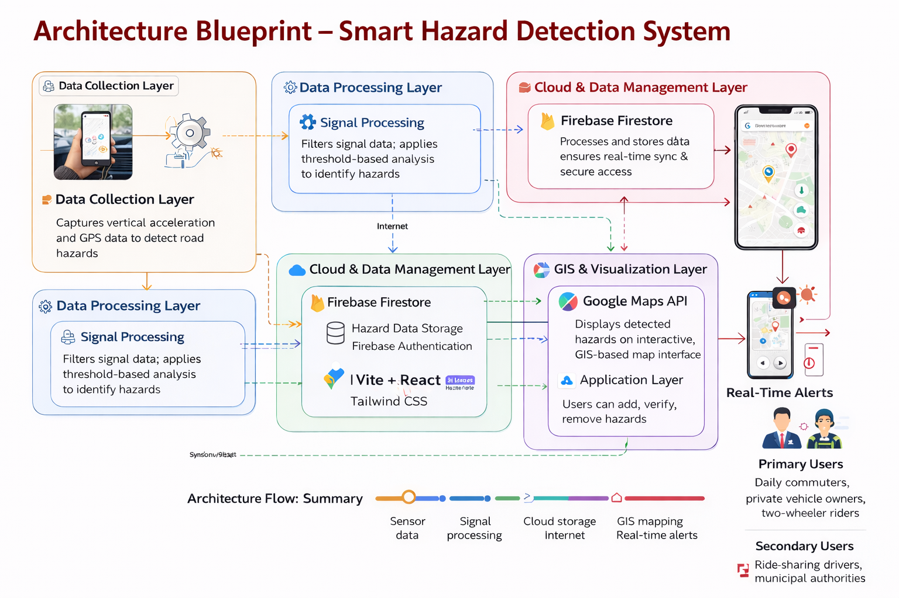

# Smart Hazard Detector

[](https://opensource.org/licenses/MIT)


A real-time road hazard detection app that warns drivers about nearby potholes, speed breakers, manholes, and unsafe road conditions — powered by live location, community reporting, and Firebase.

**🔗 Live Demo:** [smart-hazard-detector-seven.vercel.app](https://smart-hazard-detector-seven.vercel.app)
Built for **VOIS Innovation Marathon 2.0**.

## Screenshots

| Hazard map | Hazard types & severity | Navigation + voice alerts |
|---|---|---|
|  |  |  |

| Add a hazard | Remove a hazard |
|---|---|
|  |  |

## Architecture



The main device collects data from the accelerometer, GPS, and elevation change along the z-axis, runs lightweight signal processing to detect a hazard, and pushes it to Firestore. The app reads hazards from Firestore in real time and renders them on a GIS-based map, checking the user's active route against known hazards to trigger proximity alerts.

*(Full workflow diagram: `architecture/workflow-diagram.png`)*

## Features

- Real-time hazard reporting and map updates via Firebase Firestore
- Interactive Google Maps visualization with severity-based markers
- Location-based proximity alerts and route hazard analysis
- Community voting to verify or dispute hazard reports, plus a removal-request workflow
- Elevation-based route analysis (Google Elevation API)
- Voice-assisted navigation alerts

## Tech Stack

Next.js · React · TypeScript · Firebase (Firestore & Auth) · Google Maps / Directions / Elevation APIs · Tailwind CSS · Vercel

## Getting Started

```bash
git clone https://github.com/Paritosh-Nilmani/SmartHazardDetector.git
cd SmartHazardDetector
npm install
npm run dev   # http://localhost:3000
```

### Environment variables

Create `.env.local`:

```env
NEXT_PUBLIC_GOOGLE_MAP_API_KEY=your_google_maps_api_key
NEXT_PUBLIC_FIREBASE_API_KEY=your_firebase_api_key
NEXT_PUBLIC_FIREBASE_AUTH_DOMAIN=your_firebase_auth_domain
NEXT_PUBLIC_FIREBASE_PROJECT_ID=your_firebase_project_id
NEXT_PUBLIC_FIREBASE_STORAGE_BUCKET=your_firebase_storage_bucket
NEXT_PUBLIC_FIREBASE_MESSAGING_SENDER_ID=your_firebase_messaging_sender_id
NEXT_PUBLIC_FIREBASE_APP_ID=your_firebase_app_id
ELEVATION_API_KEY=your_google_elevation_api_key
```

- **Firebase:** [Firebase Console](https://console.firebase.google.com/) → create a project → add a Web App → enable Firestore.
- **Google Maps/Directions/Elevation:** [Google Cloud Console](https://console.cloud.google.com/) → enable billing → enable "Maps JavaScript API", "Directions API", "Elevation API" → create a restricted API key.

## Scripts

```bash
npm run dev      # development server
npm run build    # production build
npm run start    # production server
npm run lint     # lint checks
```

## Hazard Types & Severity

**Types:** Pothole · Speed breaker · Manhole
**Severity:** Low · Medium · High

## Related Mobile App

[SpeedBreakerDetector-RoadGuard](https://github.com/attipatalanithinchoudary-cpu/SpeedBreakerDetector-RoadGuard-) — a separate companion mobile app by a collaborator, focused on speed breaker detection.

## Roadmap

- [ ] User authentication & admin dashboard
- [ ] Image upload for hazard reports
- [ ] Automated duplicate hazard detection
- [ ] Offline support & push notifications
- [ ] Test coverage + CI/CD via GitHub Actions
- [ ] Integration with smart city / IoT infrastructure and wearables

## Contributing

PRs welcome — fork, branch, commit, and open a PR. For larger changes, open an issue first to discuss the approach.

## License

[MIT](LICENSE) — add a `LICENSE` file at the repo root if you haven't already.
